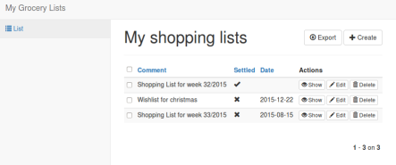
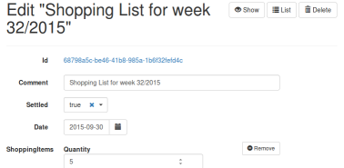

Purpose of this project
=======================
This Java/Gradle based repository illustrates a selection of Java-based
microframeworks. 
 
It implements a functionally identical grocery list application with [Spark](http://sparkjava.com),
[Ninja](http://www.ninjaframework.org), [Ratpack](https://ratpack.io), [Jodd](https://jodd.org), [Pippo](http://www.pippo.ro), [JavaLite](http://javalite.io), and a few others. 

It was originally meant as supplement for my [article on heise developer online (german)](https://www.heise.de/developer/artikel/Die-Hitparade-der-Java-Microframeworks-Ein-Blick-auf-Spark-Ninja-Jodd-und-Ratpack-3080688.html?seite=all) but is also the basis for my talk [Schlank in den Service: Der große Java-Microframework-Test!](https://programm.javaland.eu/2018/#/scheduledEvent/549567) on the Javaland conference 2018.





Prerequisites [](https://www.travis-ci.org/bentolor/microframeworks-showcase)
==============
- Installed JDK 8+ with proper set `JAVA_HOME` environment variable

This repository comes with a pre-bundled [Gradle Wrapper](https://docs.gradle.org/current/userguide/gradle_wrapper.html)
`gradlew` or `gradlew.bat` (Windows) which will download the appropriate build dependencies automatically on the first 
run. 

*Optional (recommended for development):*
- [Gradle 4.5+](https://gradle.org) 
- [Lombok](https://projectlombok.org) Plugin for your IDE of choice (Guide: [IDEA](https://projectlombok.org/setup/intellij), [Eclipse](https://projectlombok.org/setup/eclipse), …)
- IntelliJ IDEA (preferably Ultimate Edition for full Framework support) 

Spark Java
==========


[Spark](http://sparkjava.com/) is a tiny Sinatra inspired framework for 
creating web applications in Java 8 with minimal effort

Starting the demo application
-----------------------------

### Option #1: Using Gradle
Run the demo with `gradle :spark:run` and access [http://localhost:8080/](http://localhost:8080/)

### Option #2: Using IntelliJ IDEA
Open the project using IntelliJ IDEA Ultimate and execute the _Spark: Run Example_ run configuration.

### Option #3: As standalone JAR
Let gradle build the all-in-one UberJAR and directly execute it with Java (preferrably in the `spark/`
directory to leverage from the example `grocerylists.json`.

     gradlew :spark:shadowJar
     cd spark
     java -jar build/libs/spark-1.0-SNAPSHOT-all.jar
      

Ninja
=====

      
[Ninja](http://http://www.ninjaframework.org/) is a opinionated, full stack framework including 
dependency injection, a optimized development mode and support for relational DBs.

Starting the demo application
-----------------------------

### Option #1: Using Gradle
Run the demo with `gradle :ninja:run` and access [http://localhost:8080/](http://localhost:8080/) 
and [http://localhost:8080/hello](http://localhost:8080/hello)

### Option #2: Using IntelliJ IDEA
Open the project using IntelliJ IDEA and execute the _Ninja: Run Example_ run configuration.

### Option #3: As standalone JAR
Let gradle build the all-in-one UberJAR and directly execute it with Java (preferrably in the `ninja/`
directory to leverage from the example `grocerylists.json`.

     gradlew :ninja:shadowJar
     cd ninja
     java -jar build/libs/ninja-1.0-SNAPSHOT-all.jar

      
      
Ratpack
=======

      
[Ratpack](https://ratpack.io) is a reactive-oriented, type-safe microframework heavily based on Java 8 lambdas
and Netty for non-blocking IO.

Starting the demo application
-----------------------------

### Option #1: Using Gradle
Run the demo with `gradle :ratpack:run` and access [http://localhost:8080/](http://localhost:8080/).

### Option #2: Using IntelliJ IDEA
Open the project using IntelliJ IDEA and execute the _Ninja: Run Example_ run configuration.
``
### Option #3: As standalone JAR
Let gradle build the all-in-one UberJAR and directly execute it with Java (preferrably in the `ratpack/`
directory to leverage from the example `grocerylists.json`.

     gradlew :ratpack:shadowJar
     cd ratpack
     java -jar build/libs/ratpack-1.0-SNAPSHOT-all.jar      


Jodd
=======

      
[Jodd](https://jodd.org) is set of Java micro frameworks, tools and utilities, under 1.7 MB.
The framework consists of micro components, which can be used more or less independently.

                         

Starting the demo application
-----------------------------

### Option #1: Using Gradle
Run the demo with `gradle :jodd:run` and access [http://localhost:8080/](http://localhost:8080/).

### Option #2: Using IntelliJ IDEA
Open the project using IntelliJ IDEA and execute the _Jodd: Run Example_ run configuration.
Jodd by default has no embedded servlet container bundled. The example includes and configures
a Undertow server as embedded server.

### Option #3: As deployable WAR
This module originally did not provide an all-in-one UberJAR. 
Follow these steps to build a WAR file:

     gradlew :jodd:war
     cp jodd/build/libs/jodd-1.0-SNAPSHOT.war [tomcat]/webapps

### Option #4: Using a Jetty ctonainer
Run the demo with `gradle :jodd:jettyRun` and access [http://localhost:8080/jodd/](http://localhost:8080/jodd/).


Pippo
=====
````
 ____  ____  ____  ____  _____
(  _ \(_  _)(  _ \(  _ \(  _  )
 ) __/ _)(_  ) __/ ) __/ )(_)( 
(__)  (____)(__)  (__)  (_____)

````
      
[Pippo](http://www.pippo.ro) is set of Java micro framework in the spirit of Sinatra but also
offers a Controller-based approach. The core is small (around 140 KB) and can be extended with
various modules for template engine or embedded web servers. 
                      
Starting the demo application
-----------------------------

### Option #1: Using Gradle
Run the demo with `gradle :pippo:run` and access [http://localhost:8080/](http://localhost:8080/).

### Option #2: Using IntelliJ IDEA
Open the project using IntelliJ IDEA and execute the _Pippo: Run Example_ run configuration.

### Option #3: As standalone JAR
Let gradle build the all-in-one UberJAR and directly execute it with Java (preferrably in the `pippo/`
directory to leverage from the example `grocerylists.json`.

     gradlew :pippo:shadowJar
     cd pippo
     java -jar build/libs/pippo-1.0-SNAPSHOT-all.jar      


Spring Boot 2 – Spring 5 – WebFlux
==================================

      
[Spring Boot](https://projects.spring.io/spring-boot/) favors convention over configuration and is designed to get 
you up and running as quickly as possible. Spring WebFlux is the reactive successor of Spring MVC and a is fully 
non-blocking, back pressure-supporting web framework.

 
                      
Starting the demo application
-----------------------------

### Option #1: Using Gradle
Run the demo with `gradle :spring5:run` and access [http://localhost:8080/](http://localhost:8080/).

### Option #2: Using IntelliJ IDEA
Open the project using IntelliJ IDEA and execute the _Spring 5: Run Example_ run configuration. Potentially this 
requires IDEA Ultimate Edition. 

### Option #3: As standalone JAR
Let gradle build the all-in-one UberJAR and directly execute it with Java (preferrably in the `spring5/`
directory to leverage from the example `grocerylists.json`.

     gradlew :spring5:shadowJar
     cd spring5
     java -jar build/libs/spring5-1.0-SNAPSHOT-all.jar      


Developing hints
================

This project uses Gradle 4.6+ as build tool and IDEA IntelliJ inspections together with my 
[idea-cli-inspector](https://github.com/bentolor/idea-cli-inspector/) tool for quality assurance.

The great [Travis CI](https://www.travis-ci.org/bentolor/microframeworks-showcase/) service acts as 
CI service executing Tests and IDEA inpsection.

If you want to perform the IDEA Inspections within your own IDE:

* Select Analyze > Inspect Code … 
* The select Custom Scope: "Showcase Sources" & include test sources
* As inspection profile `exxcellent-2017` should be preselected.