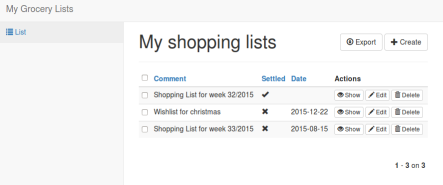
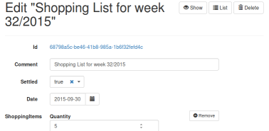

Purpose of this project
=======================
This Java/Gradle based repository illustrates a selection of Java-based
microframeworks. 
 
It implements a functionally identical grocery list application with [Spark](http://sparkjava.com/) 
and [Ninja](http://http://www.ninjaframework.org/) and is meant as supplement for my article 
on [heise developer online](http://www.heise.de/developer/).

Prerequisites
==============
- Installed JDK 8+
- [Gradle 2.8+](http://gradle.org/)
- [Lombok](http://projectlombok.org/) Plugin for your IDE of choice (Preferably: IntelliJ IDEA UE)

*Recommended:*
- IntelliJ IDEA (Ultimate Edition) 

Spark Java
==========

[Spark](http://sparkjava.com/) is a tiny Sinatra inspired framework for 
creating web applications in Java 8 with minimal effort

Starting the demo application
-----------------------------

### Option #1: Using Gradle
Run the demo with `gradle :spark:run` and access [http://localhost:8080/](http://localhost:8080/)

### Option #2: Using IntelliJ IDEA
Open the project using IntelliJ IDEA Ultimate and execute the _Spark: Run Example_ run configuration.

### Option #3: As standalone JAR
Let gradle build the all-in-one UberJAR and directly execute it with Java (preferrably in the `spark/`
directory to leverage from the example `grocerylists.json`.

     gradle :spark:shadowJar
     cd spark
     java -jar build/libs/spark-1.0-SNAPSHOT-all.jar
      

Ninja
=====

      
[Ninja](http://http://www.ninjaframework.org/) 

Starting the demo application
-----------------------------

### Option #1: Using Gradle
Run the demo with `gradle :ninja:run` and access [http://localhost:8080/](http://localhost:8080/) 
and [http://localhost:8080/hello](http://localhost:8080/hello)

### Option #2: Using IntelliJ IDEA
Open the project using IntelliJ IDEA Ultimate and execute the _Ninja: Run Example_ run configuration.

### Option #3: As standalone JAR
Let gradle build the all-in-one UberJAR and directly execute it with Java (preferrably in the `ninja/`
directory to leverage from the example `grocerylists.json`.

     gradle :ninja:shadowJar
     cd ninja
     java -jar build/libs/ninja-1.0-SNAPSHOT-all.jar
      
